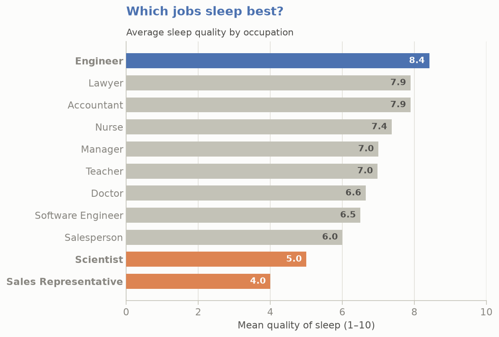
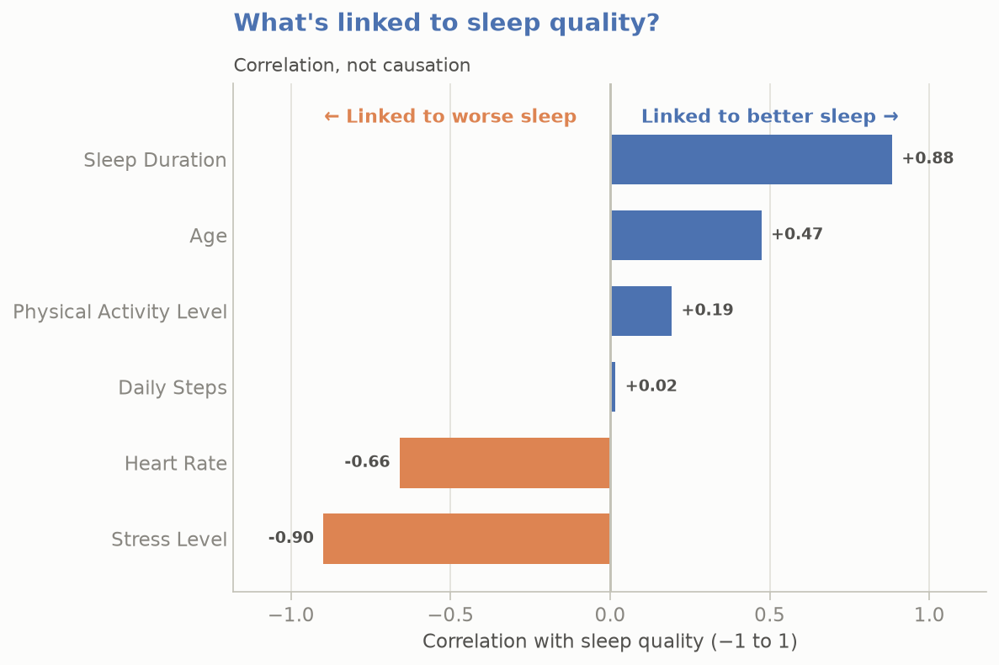
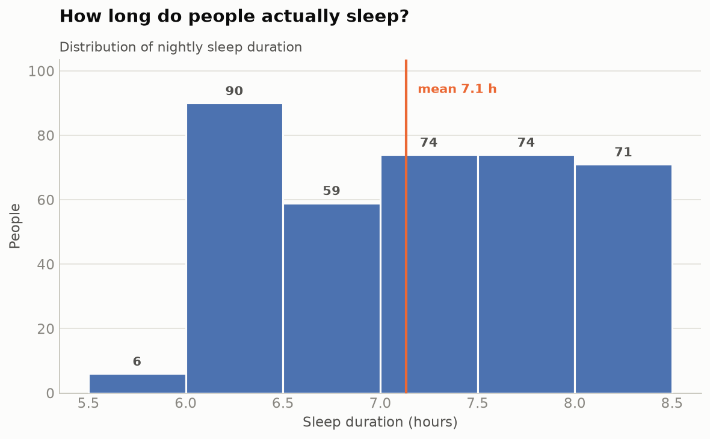
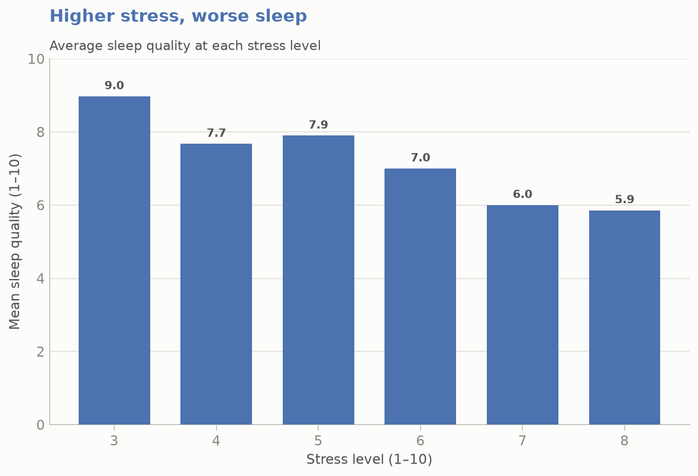
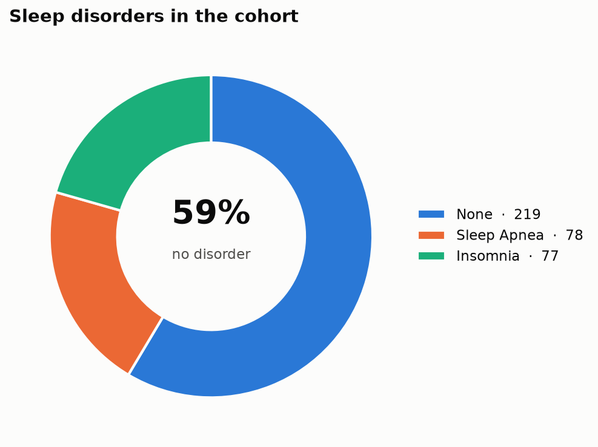

# vision_plot

**vision_plot** is a tiny, practical **visualization library** built for
sleep-health data. Give it a pandas DataFrame and get back a well-formatted,
publication-clean Matplotlib figure — every chart shares the same styling, so an
entire report looks like it came from one hand.

Built by following the *Build Your First Library* steps: `src/` layout, a real
`__init__.py` public API, `pyproject.toml` metadata, an editable install, tests,
and a wheel.

## Install

```bash
pip install vision-plot-atamang
```

Or, for local development from a clone:

```bash
python -m pip install -e .
```

> **Install name vs. import name:** you `pip install vision-plot-atamang`
> (hyphens, unique on PyPI) but `import vision_plot` (underscores — a valid
> Python name), exactly as the slides describe.

## Use

```python
import pandas as pd
import vision_plot as vp

df = pd.read_csv("data/Sleep_health.csv")

vp.summarize(df)              # {'rows': 374, 'columns': 13, 'names': [...]}
vp.missing(df)                # null counts per column, highest first

fig = vp.quality_by_occupation(df)
fig.savefig("quality.png", dpi=150, bbox_inches="tight")
```

Every chart function takes a DataFrame and **returns** a `matplotlib.figure.Figure`
— it never mutates your data and never prints. Show it, save it, or drop it into
a report.

## The API

| Function | What you get |
|---|---|
| `quality_by_occupation(df)` | Ranked horizontal bars — mean sleep quality per job |
| `sleep_duration_distribution(df)` | Histogram of nightly hours with a mean line |
| `quality_by_stress(df)` | Bars — average sleep quality at each stress level |
| `disorder_breakdown(df)` | Donut of sleep-disorder prevalence |
| `quality_correlations(df)` | Diverging bars — what helps or hurts sleep quality |
| `summarize(df)` / `missing(df)` | Plain-dict / Series EDA helpers |

## Gallery

### Ranked bars — `quality_by_occupation`


### Sleep-quality drivers — `quality_correlations`


### The rest




Regenerate the gallery any time with `python examples/generate_gallery.py`.

## Design notes (the aesthetic)

- **One palette, defined once** in `theme.py` and shared by every chart. The
  eight categorical hues are assigned in a fixed, colorblind-aware order and
  never cycled.
- **Color follows the data's job.** Ranking uses a single accent hue (magnitude,
  not identity); the correlation bars diverge from a zero baseline — blue for
  factors that lift sleep quality, warm orange for those that drag it down —
  because correlation is signed.
- **Recessive chrome.** Top/right spines dropped, a single hairline grid on the
  value axis, muted tick labels, direct value labels on bars so an axis can
  disappear entirely. The data gets the ink; the frame gets out of the way.

## Development

```bash
python -m pip install -e ".[test]"
python -m pytest          # run the smoke tests
python -m build           # build the wheel + sdist into dist/
```

## License

MIT — see [LICENSE](LICENSE).
